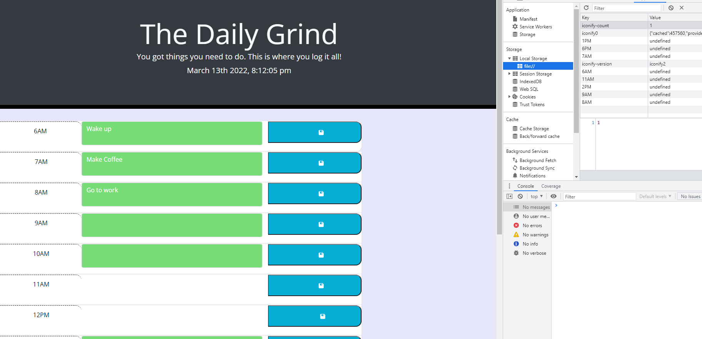

# daily-grind
Work Day Scheduler

### In this application I attempted to create a work day scheduler. I was able to work off of the code provided, and added to it. I was able to make the save button work but for some reason everything comes back as underfined, I feel like I almost have the last piece to the puzzle but I could not figure it out.

### I used a lot of module 5 to build my app, I also used taskmaster pro and some guidance from classmates. 

The following image shows a screenshot of the application.


## Accepted Criteria 

```
GIVEN I am using a daily planner to create a schedule
WHEN I open the planner
THEN the current day is displayed at the top of the calendar
WHEN I scroll down
THEN I am presented with time blocks for standard business hours
WHEN I view the time blocks for that day
THEN each time block is color-coded to indicate whether it is in the past, present, or future
WHEN I click into a time block
THEN I can enter an event
WHEN I click the save button for that time block
THEN the text for that event is saved in local storage
WHEN I refresh the page
THEN the saved events persist
```

The  link to the website is here: https://sipg789.github.io/daily-grind/
